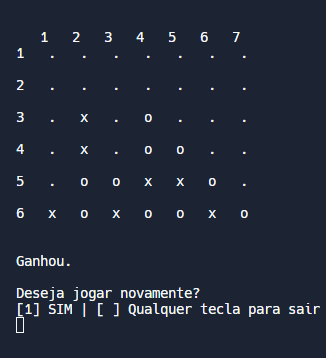

<div align="center">

# Connect-Four

`Connect Four` é um jogo criado em linguagem C.

⚠️em andamento⚠️

## Contribuíntes

* *João Lucas de Assis Oliveira* [📧](<joaolucasdeassis.o@gmail.com>)

## Como funciona?

O jogo é uma matriz composta por 6 linhas e 7 colunas.

Para vencer, os jogadores devem formar uma reta com 4 peças em quaisquer direções.



## Principais funções:

### - Inicializar o jogo  -

```c
for(int i = 0; i < linha; i++) {
    for(int j = 0; j < coluna; j++) 
      connect[i][j] = '.';
  }
```

### - jogar -
```c
void jogar() {
  
  int n, l, valida, g = 0;
  char opcao;

  imprimir();
  
  do {
    do {
      printf("\nDigite o número da coluna: ");
      scanf("%i", &n);
      
      valida = colunaValida(n);
      
      if(valida == 1) {
        printf("Sua opção: "); 
        scanf("\n%c", &opcao);
        valida += opcaoValida(opcao);
      }
  } while(valida != 2);
    
    valida += posicaoVazia(n, &l);
    
    if (valida == 3)
      connect[l][n - 1] = opcao;
    else 
      printf("Coluna cheia. Escolha outra coluna.\n\n");

    system("clear");
    
    imprimir();
    
    g += ganhouLinha();
    g += ganhouColuna();
    g += ganhouDiagPrincipal();
    //g += ganhouDiagSecundaria();

  } while(g == 0);

  if(g != 0)
    printf("\nGanhou.");
}
```

## Licensas

Este repositório não possui lincesas de uso.
</div>